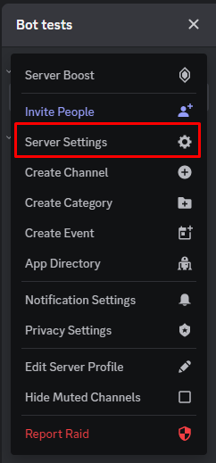
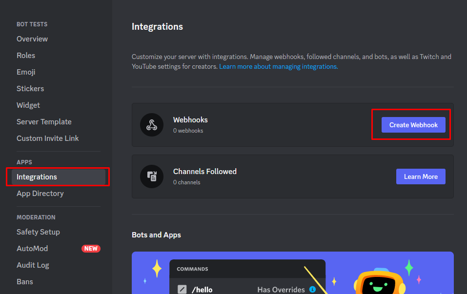
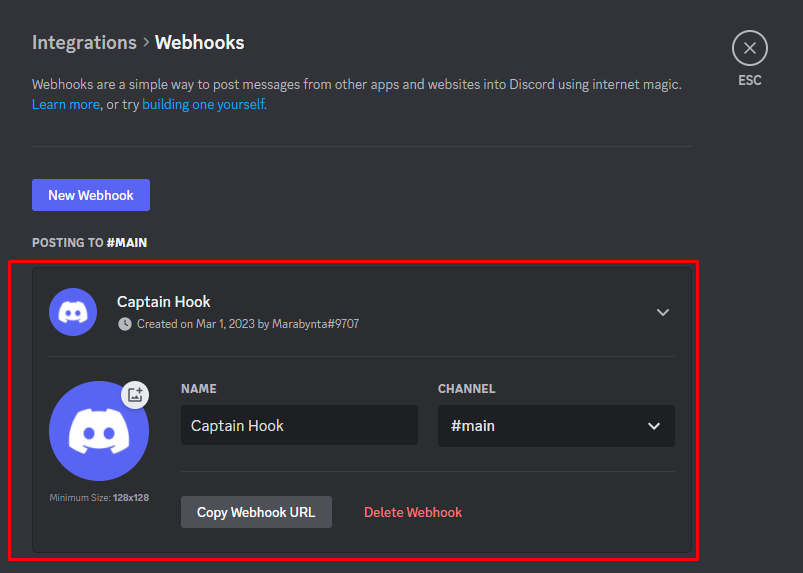
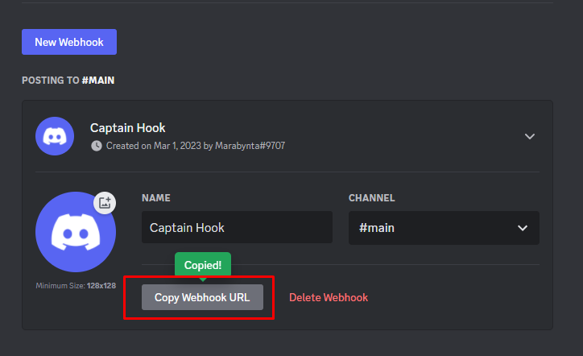
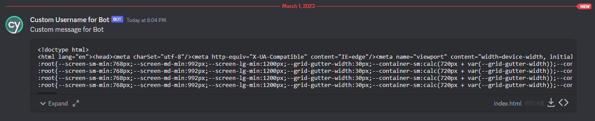

# Example for cypress-discord-webhook-integration

Example uses [cypress-mochawesome-reporter](https://www.npmjs.com/package/cypress-mochawesome-reporter)

## Prepare your Discord Server for using package

1. Open Server Settings in Discord Server



2. Open Integrations tab and click on the Create Webhook button



3. Click on your Webhook > Webhook is expanded



4. Setup your Webhook and click on the Copy Webhook URL button (this URL will be used for `.env` file)



## Installation and running

1. Clone this project:

- `https://github.com/Smoliarick/cypress-discord-webhook-integration-example.git` for HTTPS
- `git@github.com:Smoliarick/cypress-discord-webhook-integration-example.git` for SSH

2. Run `npm install` command
3. Create `.env` file with configs for Test Rail. You can use [this example](.env.example):

```
WEBHOOK_URL=your_webhook_from_discord
```

4. Run autotests: `npx cypress run`
5. Check that report is sent to your Discord channel which you selected in Discord Webhook



## Video example

https://user-images.githubusercontent.com/104084410/222214637-f130fda1-fcf3-4dab-83f7-a53a087fbbf5.mp4

## How to run new feature for converting HTML files to PNG files

```js
await sendToDiscordWebhook(
  webhookURL,     // required variable
  files,          // required variable
  customMessage,  // set to undefined if you don't use custom message, but use custom avatar, custom username or convertHtmlToPng functionality
  customUsername, // set to undefined if you don't use custom username, but use custom avatar or convertHtmlToPng functionality
  customAvatar,   // set to undefined if you don't use custom message, but use convertHtmlToPng functionality
  true,           // if you want to convert HTML files to PNG set it as true, or remove it if you don't want to use this functionality
);
```

Example (when you use only convertHtmlToPng functionality, but don't want to use other functions):

```js
await sendToDiscordWebhook(
  webhookURL,     // required variable
  files,          // required variable
  undefined,      // set to undefined if you don't use custom message, but use custom avatar, custom username or convertHtmlToPng functionality
  undefined,      // set to undefined if you don't use custom username, but use custom avatar or convertHtmlToPng functionality
  undefined,      // set to undefined if you don't use custom message, but use convertHtmlToPng functionality
  true,           // if you want to convert HTML files to PNG set it as true, or remove it if you don't want to use this functionality
);
```

Just set `true` value to `convertHtmlToPng` variable. Your paths to files should contain `.html` at the end of the file path. It convert HTML file to PNG file and put PNG file into you directory, after it these PNG files will be send to Discord.

Video example:

https://github.com/Smoliarick/cypress-discord-webhook-integration-example/assets/104084410/640ff1e8-3ccc-434c-a038-5d57ac8832b0

If you want to generate 1 PNG file with message for each spec file, use `after:spec` instead of `after:run`:

```js
on('after:spec', async (results) => {
  await afterRunHook();

  // --------------------required part------------------------------
  const sendToDiscordWebhook = require('cypress-discord-webhook-integration'); // import lib
  const webhookURL = process.env.WEBHOOK_URL; // REQUIRED: Webhook URL for Discord
  const files = ['./cypress/reports/html/index.html']; // REQUIRED: File paths
  // --------------------required part------------------------------

  // --------------------custom data------------------------------
  const customUsername = 'Custom Username for Bot'; // Custom name for Bot's username in Discord
  const customMessage = 'Custom message for Bot'; // Custom message for Bot's message in Discord
  const customAvatar = 'https://cdn.sanity.io/images/o0o2tn5x/production/13b9c8412093e2f0cdb5495e1f59144967fa1664-512x512.jpg'; // Custom avatar URL for Bot in Discord
  // --------------------custom data------------------------------

  // --------------------required part------------------------------
  // Using function
  await sendToDiscordWebhook(
    webhookURL,     // required variable
    files,          // required variable
    customMessage,  // set to undefined if you don't use custom message, but use custom avatar, custom username or convertHtmlToPng functionality
    customUsername, // set to undefined if you don't use custom username, but use custom avatar or convertHtmlToPng functionality
    customAvatar,   // set to undefined if you don't use custom message, but use convertHtmlToPng functionality
    true,           // if you want to convert HTML files to PNG set it as true, or remove it if you don't want to use this functionality
  );
  // --------------------required part------------------------------
});
```